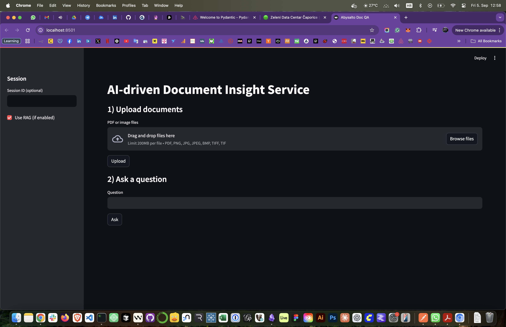
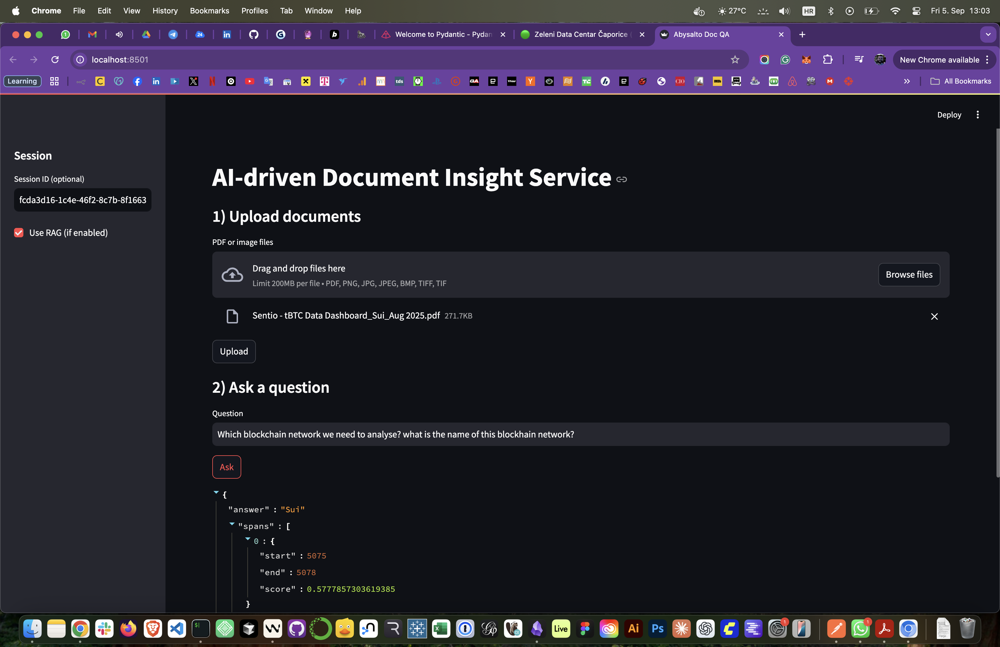

# 📄 Abysalto - AI-driven Document Insight Service

Python FastAPI service that:
- Ingests PDFs or images and extracts text (PyMuPDF for PDFs, EasyOCR for images)
- Answers questions about uploaded documents (DistilBERT QA)
- Optional RAG with Sentence-Transformers + FAISS (with NumPy fallback)
- Optional NER to highlight entities in the answer
- Dockerized service and a Streamlit demo UI

## 🔌 Endpoints
- POST `\/upload`: upload one or more documents under a session ID
- POST `\/ask`: ask a question against documents in the session

## 🧰 Manual Setup
1) Create env and install deps

```sh
python3 -m venv .venv
source .venv/bin/activate
pip install -r requirements.txt
```

2) (Optional) Download sample docs

```sh
python scripts/fetch_samples.py
```

3) Run API (8000 by default)

```sh
uvicorn app.main:app --reload --host 127.0.0.1 --port 8000
```

If port 8000 is busy, use 9000:

```sh
uvicorn app.main:app --reload --host 127.0.0.1 --port 9000
```

4) Streamlit demo (local)

```sh
API_BASE=http://127.0.0.1:8000 streamlit run streamlit_app.py
# or if API on 9000
API_BASE=http://127.0.0.1:9000 streamlit run streamlit_app.py
```

## 🐳 Docker
Build the image:

```sh
docker build -t abysalto-doc-qa .
```

Run the API (port 8000 in container):

```sh
docker run --rm -p 8000:8000 \
  -e ENABLE_RAG=true \
  -e ENABLE_NER=false \
  -e EASYOCR_LANGS=en \
  -e EASYOCR_GPU=false \
  --name abysalto_api \
  abysalto-doc-qa
```

If host port 8000 is busy, map host 9000:

```sh
docker run --rm -p 9000:8000 --name abysalto_api abysalto-doc-qa
```

Run Streamlit in Docker (optional), pointing to host API:

```sh
docker run --rm -p 8501:8501 \
  -e API_BASE=http://host.docker.internal:8000 \
  abysalto-doc-qa \
  streamlit run streamlit_app.py --server.port 8501 --server.address 0.0.0.0
```

## ⚙️ Environment Variables
- `ENABLE_RAG` (default: true): per-session retrieval index and top-k search
- `ENABLE_NER` (default: false): run NER on the final answer
- `EASYOCR_LANGS` (default: `en`): comma-separated langs for EasyOCR
- `EASYOCR_GPU` (default: `false`): set `true` if GPU is available

## 🧪 Example Requests
Upload (returns `session_id`):

```sh
curl -X POST "http://127.0.0.1:8000/upload" \
  -F "files=@sample_docs/invoice_sample.pdf"
```

Ask a question:

```sh
curl -X POST "http://127.0.0.1:8000/ask" \
  -H "Content-Type: application/json" \
  -d '{"session_id":"<SESSION_ID>","question":"What is this document about?","top_k":5}'
```

## 📚 Notes on RAG and FAISS
- The RAG index uses `sentence-transformers/all-MiniLM-L6-v2` embeddings.
- FAISS is used when available; otherwise a NumPy cosine-similarity fallback is used (helpful on macOS if FAISS wheels are unavailable).

## 🛠️ Troubleshooting
- Port already in use: run the API on a different port (e.g., 9000) and update `API_BASE` for Streamlit.
- First call is slow: models download on first use; subsequent calls are faster.
- OCR accuracy: for scanned PDFs, pages without extractable text are rasterized and passed to EasyOCR.
- Streamlit to Docker API: when Streamlit runs in Docker, use `API_BASE=http://host.docker.internal:<port>`.

## 🧭 Design Choices
- FastAPI for typed, performant APIs
- PyMuPDF for robust PDF parsing; EasyOCR for images
- DistilBERT QA for simplicity; upgradeable to larger models or external LLMs
- FAISS + MiniLM for fast RAG; fallback ensures portability
- In-memory sessions for the assignment; swappable for Redis/DB in prod

## ✅ License for Samples
The sample script fetches public/CC content. Review the links for license details.

---

## 🖼️ Screenshots (UI)
Add screenshots to `docs/screenshots/` and they will render below. Suggested shots:
- Upload & Session view
- Ask question & answer view
- Docker run + API health check

Place images here:
- `docs/screenshots/ui-home.png`
- `docs/screenshots/ui-ask.png`

Then the images will appear:




Tip: On macOS you can capture with `Cmd+Shift+4` and drag to select, then move PNGs into `docs/screenshots/`.